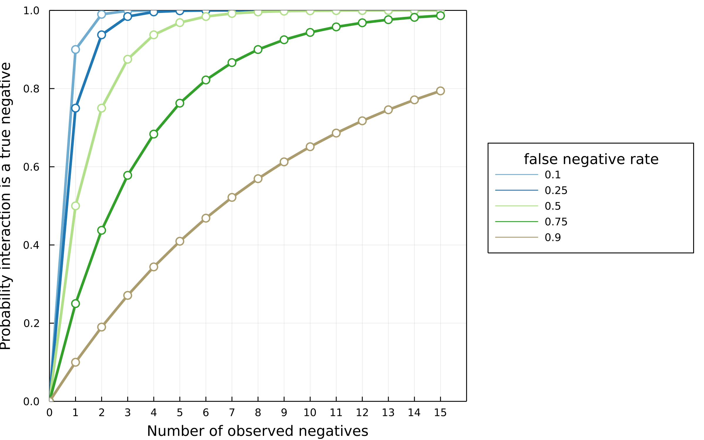

Interaction detection ms brainstorming

Observer matrix : probability of [FP, FN]

How "wrong" are measurements of network structure
(connectance, nestedness, modularity) as a function
of the observer matrix?

How wrong are predictions about interactions?

# Introduction

Ecological interactions are hard to find. Many ecological data is increasingly
available because of remote sensing.

Observer matrix : probability of [FP, FN]

How "wrong" are measurements of network structure
(connectance, nestedness, modularity) as a function
of the observer matrix?

How wrong are predictions about interactions?

Yet interaction
detection is unlikely to benefit from this as they require identification of
two species. Interactions vary in space and time.

Figure 1: The probability of a "true negative". Another thing is
true, which is that this function will never reach 1!

So many assumptions here about probability.

# False-negatives as a product of relative abundance

Does a false negative rate of 0.9 seem unrealistic? Consider
how the probability of observation occurs as a function of abundance.

In this section we contest the realised FNR is different for high abundance vs low abundance species.

Consider a probability of false negative detection per unit biomass.

In this model every observation is drawn from the distribution of the biomass distribution at a particular place and time. If we assume that this distribution
is the same everywhere (again unlikely)

Seeing two low biomass species interacting requires two relatively low prob events, which is detecting each species of low biomass.

What if there is a strength of association? Covariance of biomass of i and biomass of j due to cooccurence because this interaction is "important" for each species.

# Effects of false-negatives on network properties

# Effects of false negatives on ability to make predictions

Use the same model and data as [@Strydom2021]. Seed the training
data with false negatives at a rate $p_{fn}$. Don't do anything to
the test data. Make ROC-PR AUC plots for 3 levels of $p_{fn}$. Same
model, same data, different levels of predictive capacity.

# Conclusion

How does this influence our models of interaction prediction?

How does this effect how we design samples of interactions?

How can we correct for this bias in existing data?

# References
