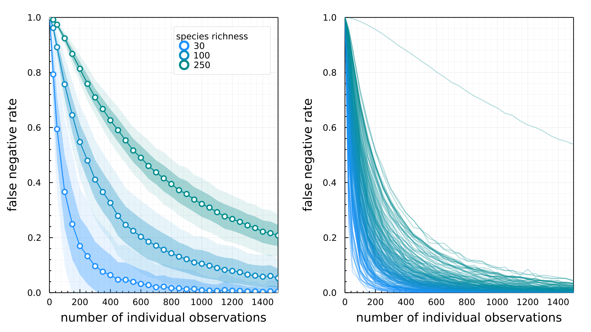

# Introduction

Ecological interactions are hard to sample [@Jordano2016SamNet]. Still,
collecting data about species interactions is imperative to measure and mitigate
the effects of human activity on Earth's biodiversity [@Jordano2016ChaEco], and
to predict potential spillover of zoonotic diseases [@cite]. Biodiversity data
has become increasingly available: remote sensing has enabled data on spatial
scales previously unsampleable, and cameras/etc. Yet sampling of ecological
interactions detection often requires human sampling as coexistance is not
indicative of interaction [@cite]. This induces constraints on sampling of
interactions based on the spatial and temporal scales feasible to human
sampling.

These sampling constraints go on to bias species interaction data: we are more
likely to observe interactions between species with high relative abundance
[@cite], and we only observe but a small fraction of the variance in species
interactions in space and time [@Poisot2015SpeWhy]. As a result of these biases,
the data we collect is noisy and likely contains many false-negatives
[@Poisot2021ImpMam]. This has many practical consequences for answering
questions about species interactions and how human activity is effecting them.

In this manuscript we seek to answer: 1) How many times do you have to observe a
non-interaction between two species to be confident in saying that is a true
negative? 2) How "wrong" are the measurements of network structure modularity as
a function of false-negative probability? 3) How do false-negatives impact our
ability to make reliable predictions about interactions?

A naive model of interaction detection would assume that every existing
interaction is incorrectly observed as a non-interaction with an independent,
fixed probability, which we denote $p_{fn}$. If we observe the same species
not-interacting $N$ times, the probability of a true negative, denoted $p_{tn}$,
is given by $p_{tn} = 1 - (p_{fn})^N$. This relation is shown in @fig:bernoulli
for varying values of the false negative rate $p_{fn}$. This shows a fundamental
dependency between our ability to reliably say an interaction doesn't
exist---measured by $p_{tn}$---and our sampling effort $N$.

{#fig:bernoulli}

# False-negatives due to relative abundances

In this section we demonstrate the realized false-negative rate (FNR) changes
drastically with sampling effort simply as a function of the distribution
of species abundances.

If we assume each individual observation of species occurs according to the
distribution of those species' abundances, seeing two low biomass species
interacting requires two relatively low probability events, which is detecting
each species of low biomass.

Controversies around theory of species abundance distributions and neutral
theory aside, for simplicity we simulate abundances from $N_S$ independent draws
from a log-normal distribution with parameters [@Volkov2003NeuThe]. We then
simulate a random food web $A$ with $N_S$ species. For each interaction ($A_{ij}
= 1$) we estimate the probability of observing both species $i$ and $j$ by
simulating a distribution of $O$ total observations, where the species observed
at the $o$-th observation is drawn from the abundance distribution. Here, $O$ is
indicative of sampling effort.

{#fig:samplingeffort}

Consider a probability of false negative detection per unit biomass. In this
model every observation is drawn from the distribution of the biomass
distribution at a particular place and time. If we assume that this distribution
is the same everywhere (again unlikely), we can express the probability that we
observe species $A$ and $B$ as $P(AB)$. What if there is a strength of
association? Covariance of biomass of i and biomass of j due to cooccurence
because this interaction is "important" for each species. In this case, the
probability of observing both $A$ and $B$, $P(AB)$, is _not_ equal to $P(A)P(B)$
as $P(A)$ and $P(B)$ are not independent. --> This implies that interactions
that are variable/opportunistic are subject to ever higher false-negative rate.

This doesn't consider variation in abundance in space and time which is kind of
a problem.

**fig here: x-axis: sampling effort , y-axis false negative prob, different
colors are different strengths of association**
alternatively, two panels: one with varying connectance, other with varying association

# Effects of false-negatives on network properties

Here we simulate a bunch of food webs using generative models.
We then simulate the effects of observation error to generate
false negatives in the sample and compare the computed network
properties of the "true" networks to the computed properties on
the observed network in order to see how much false negatives
effect our quantification of network structure.

{#fig:properties}

# Effects of false negatives on ability to make predictions

Use the same model and data as [@Strydom2021RoaPre]. Seed the training
data with false negatives at a rate $p_{fn}$. Don't do anything to
the test data. Make ROC-PR AUC plots for 3 levels of $p_{fn}$. Same
model, same data, different levels of predictive capacity.

Big takeaway here is false-negatives have way more effect on
PR space, unsurprisingly. Sadly this is also where the potential application of
is greatest.

# Conclusion

How does this influence our understanding of the structure of ecological
networks, and how we infer other things based on that.  

How does this influence our models of interaction prediction?

How does this effect how we design samples of interactions?

How can we correct for this bias in existing data?

# References
