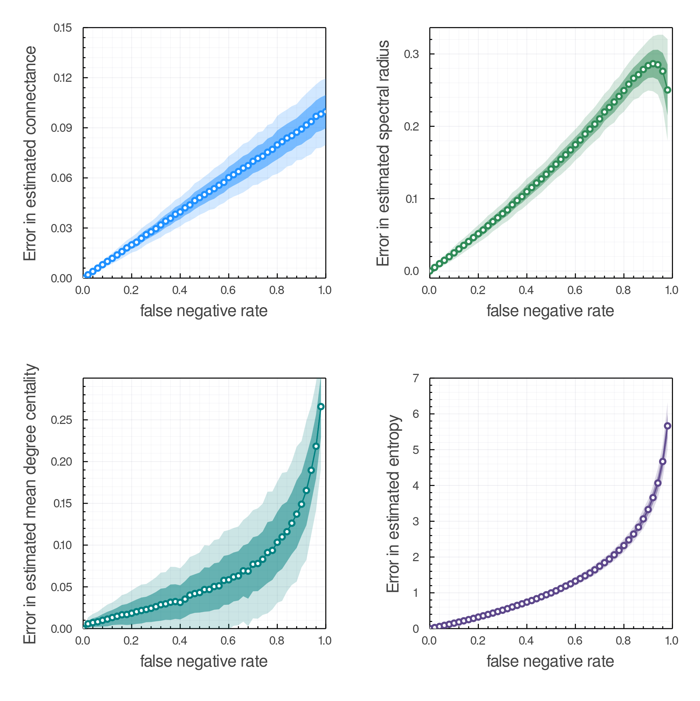

# Introduction

> It may, therefore, be a subject worthy of curiosity, to enquire what is the
> nature of that evidence which assures us of any real existence and matter of
> fact, beyond the present testimony of our senses, or the records of our
> memory.
>
> David Hume, _An Enquiry Concerning Human Understanding_

Understanding how different species interact is a fundamental question of
community ecology and an increasing imperative both to mitigate the effects of
human activity on Earth's biodiversity [@Makiola2020KeyQue; @Jordano2016ChaEco]
and to predict potential spillover of zoonotic disease [@Becker2020PreWil]. Over
the past decade biodiversity data has become increasingly available due to
improved sensing technology [@Stephenson2020TecAdv] and increased adoption of
open data sharing practices [@Kenall2014OpeFut]. Modern remote-sensing has
enabled collection of data on spatial scales and resolutions previously
unimaginable, and in-situ sensors in the form of both camera-traps and
environmental sensors have substantially increased the amount of in-situ data
available to ecologists. Yet widespread data about species interactions has
remained illusive as detection of an interaction between two species often
requires human sampling [@Strydom2021RoaPre], as although remote methods can be
used to detect cooccurrence, this itself is not necessarily indicative of
interaction [@Blanchet2020CooNot]. This limitation induces constraints on
sampling of interactions based on the spatial and temporal scales feasible to
human sampling.

These sampling constraints go on to bias species interaction data in several
ways: we only observe a small fraction of the variation of species interactions
in space and time, sampling of species interactions is geographically biased
toward the usual suspects [@Poisot2021GloKno], and these observations themselves
are reflect the distribution of abundance within communities
[@Poisot2015SpeWhy]. These biases have practical consequences for answering
questions about species interactions [@deAguiar2019RevBia]. The data we collect
is noisy and likely contains many _false-negatives_, where there is not an
observation of two species interacting even though they actually interact in
some capacity.

Here we seek to understand how false negatives in ecological interaction data
impact the analysis and prediction of ecological networks, and also to determine
how the relationship between sampling effort and likelihood of a "true negative"
can guide how we design surveys of ecological interactions [@Jordano2016SamNet].
In this manuscript the questions we seek to answer are: 1) How many
times do you have to observe a non-interaction between two species to be
confident in saying that is a true negative? 2) How "wrong" are the measurements
of network structure modularity as a function of false-negative probability? and
lastly 3) How do false-negatives impact our ability to make reliable predictions
about interactions? We conclude by suggest use of null models similar to those
presented here as a tool for guiding design of surveys of species interactions
henceforth.

# How many observations of a non-interaction do we need to classify it as a true negative?

To answer the titular question of this section, we present a naive model of
interaction detection: we assume that every true interaction between two species
is incorrectly observed as a non-interaction with an independent and fixed
probability, which we denote $p_{fn}$ and subsequently refer to as the
False-Negative Rate (FNR). If we observe the same species not-interacting $O$
times the probability of a true negative, denoted $p_{tn}$, is given by $p_{tn}
= 1 - (p_{fn})^O$. This relation is shown in @fig:negativebinom for varying
values of the false negative rate $p_{fn}$. This illustrates a fundamental link
between our ability to reliably say an interaction doesn't
exist---$p_{tn}$---and our sampling effort $O$. Further, within this model there
is no non-zero $p_{fn}$ for which we can ever _prove_ that an interaction does
not exist.

{#fig:negativebinom}

From @fig:negativebinom (and general intuition) it is clear that the more times
we see two species _present_, but ***not*** interacting, the more likely the
interaction is a true negative. But what should the threshold of number of
observations be? If false-negative rates presented in @fig:negativebinom seem
unrealistically high, consider that species are not observed independent of
their relative abundance. In the next section we demonstrate the distribution of
biomass in ecosystems can lead to high realized values of $p_{fn}$ for the
majority of species, which are species with low relative abundance. We suggest
using neutral models of species abundances to design the number of observations
sufficient to say an interaction doesn't exist.

## False-negatives as a product of relative abundance

In this section we demonstrate the realized false-negative rate (FNR) changes
drastically with sampling effort, largely due to the intrinsic variation of
abundances within a community. We do this by simulating the process of
observation of species interactions, applied both to 243 empirical food webs
from the Mangal database [@Banville2021ManJl] as well as random food-webs
generated using the niche model [@Williams2000SimRul]. Our neutral model of
observation assumes each observed species is drawn from the distribution of
those species' abundances at that place and time. Although there is no shortage
of debate as to the processes the govern the general shape of this distribution,
across communities the abundance distribution can be reasonably-well described
by a log-normal distribution [@Volkov2003NeuThe]. Controversies around theory of
species abundance distributions aside, the practical consequence of skewed
distribution of biomass in communities is seeing two low biomass species
interacting requires two low probability events, which is observing two species
of low relative biomass.

For each ecological network $A$ with $S$ species, we simulate abundances from
$S$ independent draws from a standard-log-normal distribution. For each true
interaction $A_{ij} = 1$ we estimate the probability of observing both species
$i$ and $j$ at given place and time by simulating a distribution of $O$
individual observations, where the species observed at the $o=1,2,\dots,O$-th
observation is drawn from the generated lognormal distribution of abundances.
For each pair of species $(i,j)$, if both $i$ and $j$ are observed within the
$O$ observations, the interaction is tallyed as a true positive if $A{ij}=1$ and
a false positive otherwise. Similarly, if $i$ and $j$ are _not_ observed in
these $O$ observations, but $A_{i,j}=1$, this is counted as a false-negative,
and a true-negative otherwise. @fig:samplingeffort shows this model applied to
243 food-webs from the Mangal database on the left, and niche model
[@Williams2000SimRul] across varying levels of species richness on the right.
All simulations were done with 500 replicates of per unique number of
observations $O$, and analyses presented here are done in Julia v1.6 [@cite]
using both EcologicalNetworks.jl v0.5 and Mangal.jl v0.? [@Banville2021ManJl].
Note that the empirical data also is, due to the phenomena described here, very
likely to _already_ have many false negatives, which is why we are interested in
prediction of networks in the first place---we'll revisit this in the final
section.

{#fig:samplingeffort}

Empirical data on interactions, limited by the practical realities of funding
and human-work hours, tends to fall on the order on 100s or 1000s of individual
observations per site [@Nielsen2007EcoNet; TK more cites coming soon], and a
meta-analysis of ecological network data and sampling effort seems both
pertinent and necessary. From @fig:samplingeffort it is evident that the number
of species considered in a study is inseparable from the false-negative rate in
that study, and this effect should be taken into account when designing samples
of ecological networks in the future.

## Positive associations can increase the probability of false-negatives

This model above doesn't consider the possibility that there are positive or
negative associations which shift the realized probability of observing two
species together as a consequence of their interaction. However, here we
demonstrate that the probability of observing a false negative is _higher_ if
there is some positive association between occurrence of species $A$ and $B$. If
we denote the probability that we observe an existing interaction between $A$
and $B$ as $P(AB)$, and if there is no association between the separate marginal
probabilities of observing $A$ and observing $B$, denoted $P(A)$ and $P(B)$
respectfully, then the probability of observing the interaction $P(AB) =
P(A)P(B)$.

In the other case where there _is_ some positive strength of association between
observing both $A$ and $B$ because this interaction is "important" for each
species, then the probability of observation both $A$ and $B$, $P(AB)$, is
greater than $P(A)P(B)$ as $P(A)$ and $P(B)$ are not independent and instead are
positively correlated, _i.e._ $P(AB) > P(A)P(B)$. In this case, the probability
of observing a false negative in our naive model from before is $p_{fn} = 1 -
P(AB)$ which due to the above inequality implies $p_{fn} \geq 1 - P(A)P(B)$
which indicates increasingly greater probability of a false negative if $P(AB)
\gg P(A)P(B)$. This should be noted with caveat that in this model we do not
consider variation in abundance in space and time. If positive or negative
association structure variation in the distribution of $P(AB)$ across space,
then the spatial and temporal structure of data collection will further impact
our data as in this case the probability of false negative would not be constant
for each pair of species across sites.

We now transition toward assessing the effects of false negatives in our data on
the properties derived from these measurements, and for use as data for
predicting interactions in the future.

# The impact of false-negatives on network analysis and prediction

In this section we quantify the effects of false-negatives in interaction data
on the properties of interaction networks, and to determine how false negatives
in data impact the quality of our predictive models of network structure
[@Strydom2021RoaPre].

## Effects of false-negatives on network properties

Here we simulate the effects of observation error to generate synthetic data
with a known proportion of false negatives to compare the computed network
properties of the original "true" network to the computed properties of the
"observed" network with added false-negatives. In @fig:properties we show four
properties (connectance, spectral radius, mean degree-centrality, and entropy)
computed across 200 replicates at each value of the false negative rate
$p_{fn}$. Each replicate uses a random food web simulated using the niche model
[@Williams2000SimRul] with $100$ species and true connectance $C=0.1$.

{#fig:properties}

The primary information to be gained from @fig:properties is that properties
vary in their response to number of false negatives in a sample---spectral
radius (generally a measure of global structure) and connectance show roughly
linear responses to false negatives, whereas mean degree centrality and entropy
show decisively non-linear responses. We propose that simulating the effects of
false negatives in data can serve as an additional validation tool when aiming
to detect structural properties of networks using generative null models
[@Connor2017UsiNul].   

## Effects of false negatives on ability to make predictions

In this section, we assess the effect of false negatives in data on our ability
to make predictions about interactions. The prevalence of false-negatives in
data methods have been proposed to counteract this bias [@Poisot2021ImpMam],
However, if there are too many false negatives in a dataset, this could induce
too much noise for a interaction prediction model to detect the signal of
interaction due to the latent properties of each species derived from the
empirical network.

To test this, we use the same predictive model and dataset as in
@Strydom2021RoaPre to predict a metaweb from various empirical slices of the
species pool observed across space. This dataset from @Hadfield2014TalTwo
describes host-parasite interaction networks sampled across 51 sites. We
partition the data into 80-20 training-test split, and then seed the training
data with false negatives varying rates, but crucially do nothing to the test
data. We use the same model, a neural-network with 3 layers to predict outputs
based on features extracted from cooccurence, see @Strydom2021RoaPre for more
details. In @fig:rocpr, we show receiving-operating-characteristic (ROC) and
precision-recall (PR) curves for the model with varying levels of
false-negatives added to the data.

{#fig:rocpr}

The primary takeaway here is false-negatives have more effect on PR space,
unsurprisingly, but sadly this is also where the potential application of is
greatest. Still, model performance changes little with many added
false-negatives, which is good evidence in favor of this type of model. Similar
to our caveat in the previous section, this data is _already_ likely to have
many false-negatives. So, the effects of adding more, as we do in this
illustration, might be mitigated because there are already non-simulated
false-negatives in the original data present in the $FNR=0$ simulation.

# Conclusion

In this paper we have demonstrated we expect a certain number of false negatives
in species interaction datasets purely due to the distribution of abundances
within a community. We have also shown that these false negatives can cause
varying responses in our measurements of network properties and further could
impact our ability to reliably predict interactions.

How can this effect how we design samples of interactions [@Jordano2016SamNet]?
The primary takeaway is that when planning the sampling effort across sites, it
is necessary to take both the species richness of the metaweb into account.
Further simulating the process of observation can be a powerful tool for planing
study design which takes relative abundance into account, and provide a null
baseline for detection of interaction strength. A model similar to that here can
and should be used to provide a neutral expectation of true-negative probability
given a number of observations of individuals at a given place and time.

What does the future hold for this research?
A brief note on is here we
do not consider the rate of false positives---in large part false positives can
be explained by misidentification of species.

How does this influence our understanding of the structure of ecological
networks, and how we infer other things based on that? How does this influence
our models of interaction prediction? Toward models which explicitly account for
uncertainty in detection and sampling, [@Young2021RecPla; @Johnson2021BayEst].
Such has been done in occupancy modeling, in neural nets [@Joseph2020NeuHie],
could be integrated in the predictive models of the future. Can we correct for
this bias in existing data? [@Poisot2021ImpMam]

# References
