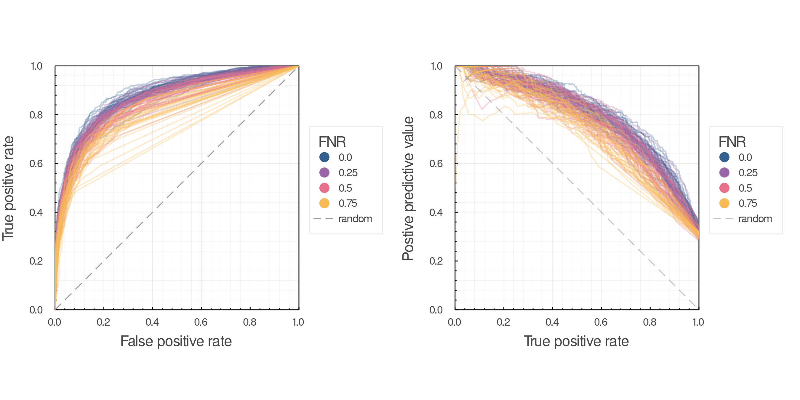

# Introduction

Ecological interactions are hard to sample [@Jordano2016SamNet]. Still,
collecting data about species interactions is imperative to measure and mitigate
the effects of human activity on Earth's biodiversity [@Andys90AuthorPaper;
@Jordano2016ChaEco], and to predict potential spillover of zoonotic diseases
[@cite]. Over the past decade biodiversity data has become increasingly
available, both due to improved sensing technology [@Stephenson2020TecAdv] but
also growth of open and FAIR databases. Remote sensing has enabled data on
spatial scales previously unsampleable, and in-situ observations in the form of
both cameras and environmental sensors have greatly improved the resolution of
data. Yet sampling of ecological interactions detection often requires human
sampling as coexistance is not necessarily indicative of interaction [@cite].

This induces constraints on sampling of interactions based on the spatial and
temporal scales feasible to human sampling. These sampling constraints go on to
bias species interaction data: we are more likely to observe interactions
between species with high relative abundance, and we only observe but a small
fraction of the variance in species interactions in space and time
[@Poisot2015SpeWhy]. Further sampling of species interactions is geographically
biased toward the usual suspects [@Poisot2021Biases]. These biases the data we.
collect is noisy and likely contains many false-negatives. This has many
practical consequences for answering questions about species interactions and
how human activity is effecting them [@deAguiar2019RevBia].

In this manuscript we seek to determine how false negatives impact analysis and
prediction of ecological networks, and how understanding the relationship
between sampling effort and probability of a true negative can guide how we
design surveys of ecological interactions [@Jordano2016SamNet]. The fundemental
questions here are: 1) How many times do you have to observe a non-interaction
between two species to be confident in saying that is a true negative? 2) How
"wrong" are the measurements of network structure modularity as a function of
false-negative probability? 3) How do false-negatives impact our ability to make
reliable predictions about interactions?

A naive model of interaction detection would assume that every true interaction
is incorrectly observed as a non-interaction with an independent and fixed
probability, denoted $p_{fn}$. In this model, if we observe the same species
not-interacting $N$ times the probability of a true negative, $p_{tn}$, is given
by $p_{tn} = 1 - (p_{fn})^N$. This relation is shown in @fig:bernoulli for
varying values of the false negative rate $p_{fn}$. This illustrates a
fundamental link between our ability to reliably say an interaction doesn't
exist---$p_{tn}$---and our sampling effort $N$.

{#fig:bernoulli}

# False-negatives as a product of relative abundance

In this section we demonstrate the realized false-negative rate (FNR) changes
drastically with sampling effort simply as a function of the distribution of
species abundances. One sentence of how you do this, and that you use both
simulated food-webs and real mangal data [@cite mangal].

Here we assume each individual observation of a given single
species $i$ within a species pool occurs according to the distribution the
abundances of the species in that species pool .

Seeing two low biomass species interacting requires two relatively low
probability events, which is detecting each species of low biomass.
Controversies around theory of species abundance distributions and neutral
theory aside, for simplicity we simulate abundances from $N_S$ independent draws
from a log-normal distribution with parameters [@Volkov2003NeuThe]. We then
simulate a random food web $A$ with $N_S$ species. For each interaction ($A_{ij}
= 1$) we estimate the probability of observing both species $i$ and $j$ by
simulating a distribution of $O$ total observations, where the species observed
at the $o$-th observation is drawn from the abundance distribution. Here, $O$ is
indicative of sampling effort.

{#fig:samplingeffort}

This simple model doesn't consider the possibility that there are positive or
negative associations between observing two species together based their
interaction.

However, we can demonstrate that the probability of observing a false negative
is _higher_ if there is some positive association between occurrence of species
$A$ and $B$. We can express the probability that we observe an existing
interaction between as $P(AB)$. If there is no correlation between probability
of observing $A$ and observing $B$, then the probability of observing the
interaction $P(AB) = P(A)P(B)$. In this case, the probability of observing both
$A$ and $B$, which we denote $P(AB)$, is not equal to $P(A)P(B)$ as $P(A)$ and
$P(B)$ are not independent. If there some positive strength of association
between observing both $A$ and $B$ because this interaction is "important" for
each species, then
$$P(AB) > P(A)P(B)$$

In this case, the probability of observing a false negative is
$p_{fn} = 1 - P(AB)$ which due to the above inequality due to positive
associated implies

$$p_{fn} \geq 1 - P(A)P(B)$$

Caveats: this doesn't consider variation in abundance in space and time which is
kind of a problem. In this model every observation is drawn from the
distribution of the biomass distribution at a particular place and time. We
assume that this distribution is the same everywhere (again unlikely).

Transition to next two sections: testing the effects of false negatives in our
data on the properties derived from these measurements, and for use as data for
predicting interactions in the future. What levels of false negatives are
acceptable to infer network properties and predict interactions.

# Effects of false-negatives on network properties

Here we simulate the effects of observation error to generate false negatives in
the samples of ecological networks and compare the computed network properties
of the original network to the computed properties on the observed network in
order to see how false negatives effect our quantification of network structure.

{#fig:properties}

# Effects of false negatives on ability to make predictions

Use the same model and data as [@Strydom2021RoaPre]. Seed the training
data with false negatives at a rate $p_{fn}$. Don't do anything to
the test data. Make ROC-PR AUC plots for 3 levels of $p_{fn}$. Same
model, same data, different levels of predictive capacity.

Big takeaway here is false-negatives have way more effect on
PR space, unsurprisingly. Sadly this is also where the potential application of
is greatest.

# Conclusion

How does this influence our understanding of the structure of ecological
networks, and how we infer other things based on that.  

How does this influence our models of interaction prediction?

How does this effect how we design samples of interactions?

How can we correct for this bias in existing data?

# References
